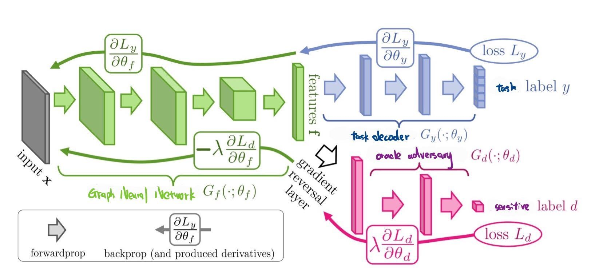
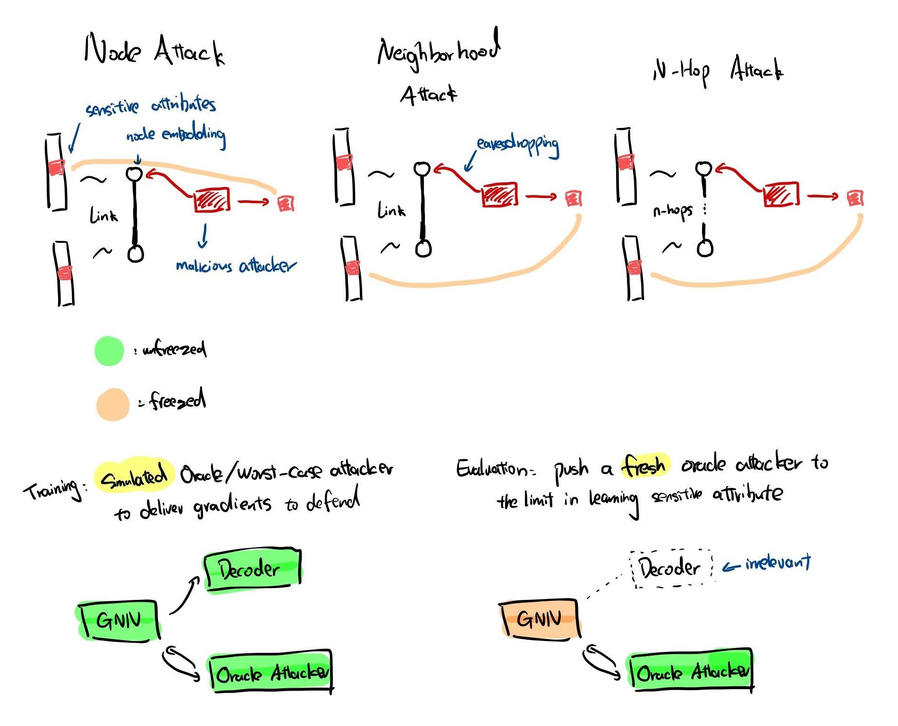
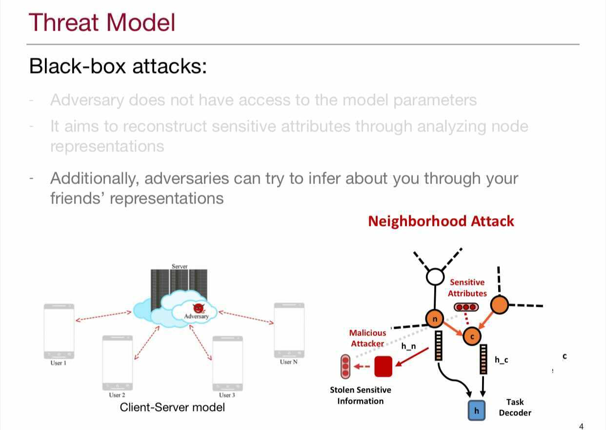
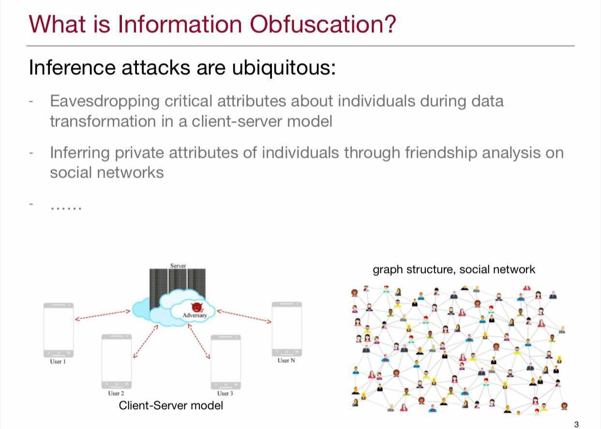
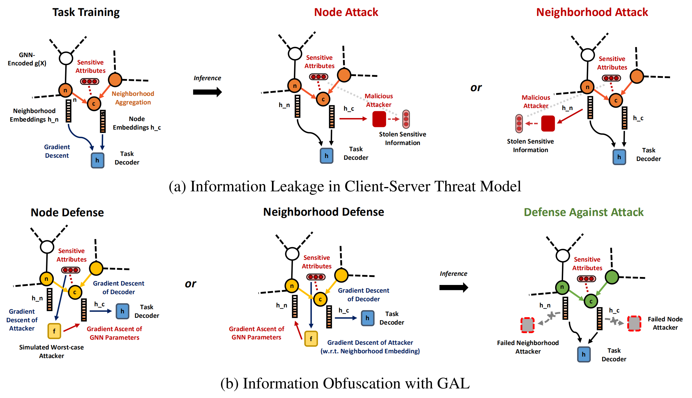
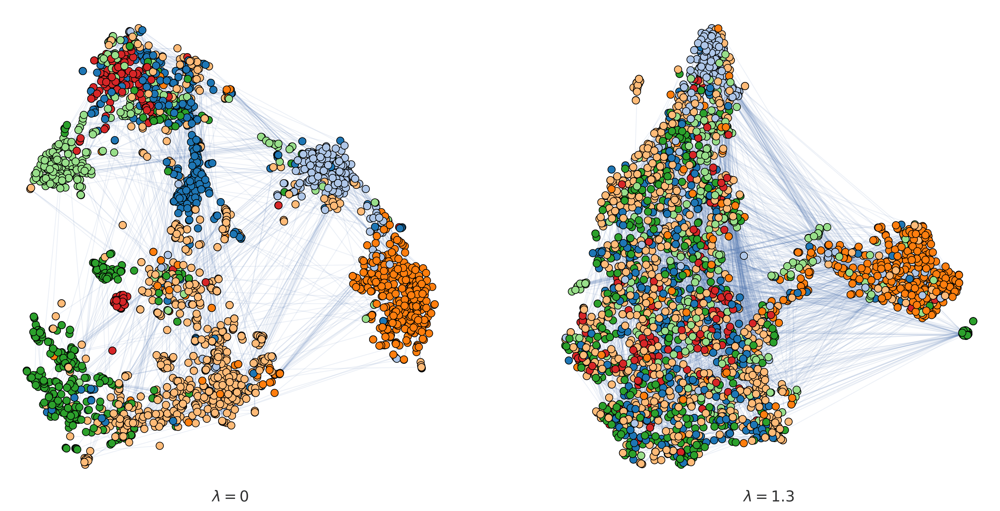
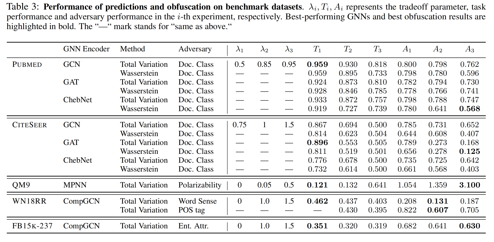

# Information Obfuscation of Graph Neural Networks

[](https://github.com/psf/black)


Peiyuan Liao*, Han Zhao*, Keyulu Xu*, Tommi Jaakkola, Geoffrey Gordon, Stefanie Jegelka,
Ruslan Salakhutdinov. ICML 2021.

\* Denotes equal contribution

This repository contains a PyTorch implementation of **G**raph **A**dversaria**L** Networks (GAL).

## Dependencies

 - Compatible with PyTorch 1.7.0 and Python 3.7.x
 - torch_geometric == 1.6.3 with newest packages specified below:

```
export CUDA=cu92/cu100/cu101/cpu
pip install --no-index torch-scatter -f https://pytorch-geometric.com/whl/torch-1.7.0+${CUDA}.html
pip install --no-index torch-sparse -f https://pytorch-geometric.com/whl/torch-1.7.0+${CUDA}.html
pip install --no-index torch-cluster -f https://pytorch-geometric.com/whl/torch-1.7.0+${CUDA}.html
pip install --no-index torch-spline-conv -f https://pytorch-geometric.com/whl/torch-1.7.0+${CUDA}.html
pip install torch-geometric
```

## Dataset

- We use Movielens-1M dataset for recommendation system link prediction task. You may access the data at [this link.](https://grouplens.org/datasets/movielens/1m/)

## Running

   - create config file by running `python gen_json.py` under config folder
   - run `exec.py --config_path=config`
   - results are reported in log, and models are available on wandb

## TL:DR

Adversarial training on graph neural networks that defend from inference attacks stealing sensitive attributes from nodes and neigbors of nodes.

To train them, we attach an simulated oracle adversary after GNN along with a gradient reversal layer.

* Optimization pass: gradient **descent** of GNN, gradient **descent** of task decoder wrt ideal task
* Defense pass: gradient **ascent** of GNN, gradient **descent** of simulated oracle adversary wrt sensitive task

Network architecture, courtesy of (Ganin et al., 2016):


We alternate between the two passes with a certain cadence.

Key Terminologies:



## Motivation





## Our Algorithm and Model

The following figure gives a high-level illustration of our model, **G**raph **A**dversaria**L** Networks (GAL). GAL defends node and neighborhood inference attacks via a min-max game between the task decoder (blue) and a simulated worst-case attacker (yellow) on both the embedding (descent) and the attributes (ascent). Malicious attackers will have difficulties extracting sensitive attributes at inference time from GNN embeddings trained with our framework.

The main dataset of interest for this work is Movielens-1M 3
, a benchmarking dataset in evaluating
recommender systems, developed by (Harper & Konstan, 2015). In this dataset, nodes are either users or movies, and the
type of edge represents the rating the user assigns to a movie. Adapting the formulation of (Bose & Hamilton, 2019b), we
designate the main task as edge prediction and designate the adversarial task as extracting user-related information from the
GNN embedding using multi-layer perceptrons with LeakyReLU functions (Maas, 2013) as nonlinearities. Training/test
splits are creating using a random 90/10 shuffle. The network encoder consists of a trainable embedding layer followed
by neighborhood aggregation layers. Node-level embeddings have a dimension of 20, and the decoder is a naive bilinear
decoder, introduced in (Berg et al., 2017). Both the adversarial trainers and the main task predictors are trained with separate
Adam optimizers with learning rate set to 0.01. Worst-case attackers are trained for 30 epochs with a batch-size 256 nodes
before the original model is trained for 25 epochs with a batch-size of 8,192 edges.

For the objective function, we selected block gradient descent-ascent to optimize our models. In particular,
we took advantage of the optim module in PyTorch by designing a custom gradient-reversal layer,
first introduced by (Ganin et al., 2016), to be placed between the attacker and the GNN layer we seek to defend. The
implementation of the graident-reversal layer can be found in the Appendix. During training, we would designate two
Optimizer instances, one having access to only task-related parameters, and the other having access to attack-related
parameters and parameters associated with GNN defense. We could then call the .step() method on the optimizers in an
alternating fashion to train the entire network, where the gradient-reversal layer would carry out both gradient descent (of
the attacker) and ascent (of protected layers) as expected. Tradeoff control via λ is achieved through multiplying the initial
learning rate of the adversarial learner by the desired factor. For graphs that are harder to optimize, we introduce pre-training
as the first step in the pipeline, where we train the encoder and the task decoder for a few epochs before introducing the
adversarial learner.




## Visualization of Learned Representations against Attacks
GAL effectively protects sensitive information. Both panels show t-SNE plots of the learned feature representations of a graph under different defense strengths. Node colors represent node classes of the sensitive attribute. The left panel corresponds to the learned representations with no-defense, while the right panel shows the representations learned by GAL. Note that without defense from GAL, the representations on the left panel exhibits a cluster structure of the sensitive attribute, make it easier for potential malicious attackers to infer. As a comparison, with GAL defense, nodes with different sensitive values are well mixed, making it hard for attackers to infer. 


## Results



## Citation

If you find the work useful in your research, please consider citing:

```
@InProceedings{pmlr-v139-liao21a,
  title = 	 {Information Obfuscation of Graph Neural Networks},
  author =       {Liao, Peiyuan and Zhao, Han and Xu, Keyulu and Jaakkola, Tommi and Gordon, Geoffrey J. and Jegelka, Stefanie and Salakhutdinov, Ruslan},
  booktitle = 	 {Proceedings of the 38th International Conference on Machine Learning},
  pages = 	 {6600--6610},
  year = 	 {2021},
  editor = 	 {Meila, Marina and Zhang, Tong},
  volume = 	 {139},
  series = 	 {Proceedings of Machine Learning Research},
  month = 	 {18--24 Jul},
  publisher =    {PMLR},
  pdf = 	 {http://proceedings.mlr.press/v139/liao21a/liao21a.pdf},
  url = 	 {http://proceedings.mlr.press/v139/liao21a.html},
  abstract = 	 {While the advent of Graph Neural Networks (GNNs) has greatly improved node and graph representation learning in many applications, the neighborhood aggregation scheme exposes additional vulnerabilities to adversaries seeking to extract node-level information about sensitive attributes. In this paper, we study the problem of protecting sensitive attributes by information obfuscation when learning with graph structured data. We propose a framework to locally filter out pre-determined sensitive attributes via adversarial training with the total variation and the Wasserstein distance. Our method creates a strong defense against inference attacks, while only suffering small loss in task performance. Theoretically, we analyze the effectiveness of our framework against a worst-case adversary, and characterize an inherent trade-off between maximizing predictive accuracy and minimizing information leakage. Experiments across multiple datasets from recommender systems, knowledge graphs and quantum chemistry demonstrate that the proposed approach provides a robust defense across various graph structures and tasks, while producing competitive GNN encoders for downstream tasks.}
}

```
